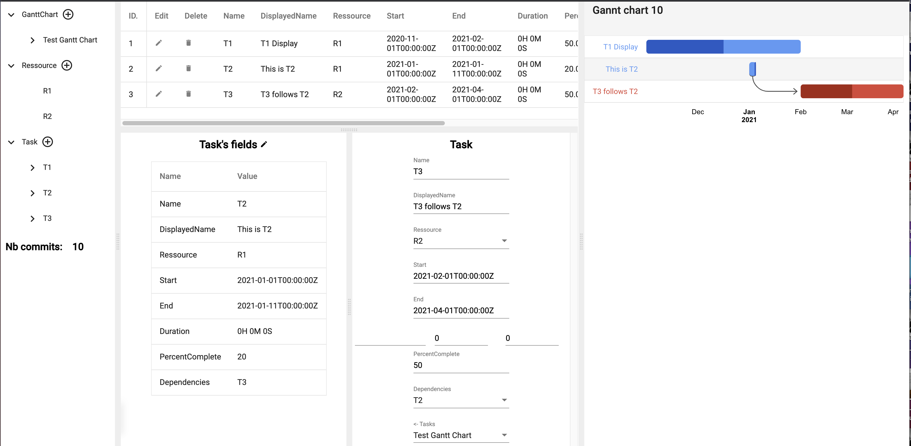

A gong stack for displaying google charts

### compile application
> cd ng; npm i; ng build;

### launch application

at the root of the repository (requires go >= 1.16)
> go run main.go

```
 Executing task: go run main.go <

gonggooglecharts: Database Migration of package github.com/fullstack-lang/gonggooglecharts/go is OK
gonggooglecharts: Server ready to serve on localhost:8080
```

### expected result

launch browser on http://localhost:8080


